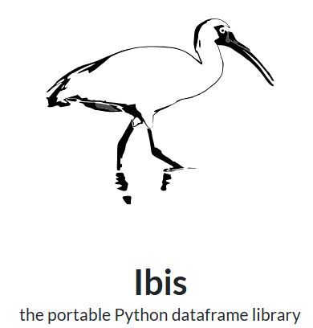

  

###

<h1 align="center">Welcome!</h1>

###

<h3 align="left">👩‍💻  About Me</h3>

###

I'm Brendan from the Bronx, NY   - 🔭 I’m working as a digital presence and web development intern at Redhand Advisors - 📚 I'm a senior computer information systems major at Manhattan University  - ⚡ In my free time I like to play guitar and skate

###

<h3 align="left">🛠 Language and tools</h3>

###

